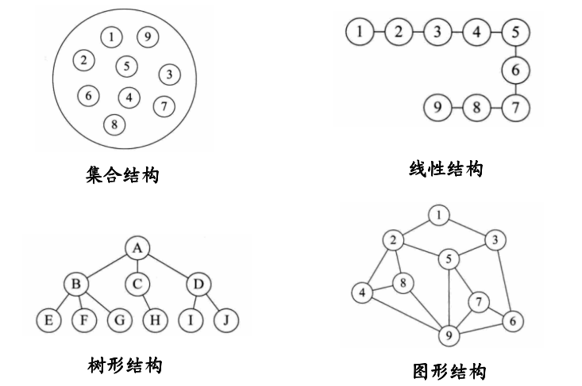

# DataStructure
数据结构学习笔记

# 目录

<!-- MarkdownTOC depth=4 -->

- [1.概论](#Introduction)
- [2.线性表](src/LinearList/LinearList.md)
- [3.栈和队列](src/StackQueue/StackQueue.md)
- [4.串和数组](src/StringArray/StringArray.md)
- [5.树和二叉树](src/TreeBinarytree/TreeBinarytree.md)
- [6.图](src/Graph/Graph.md)
- [7.集合与查找](src/SetSearch/SetSearch.md)
- [8.散列表](src/Hashtable/Hashtable.md)
- [9.排序](src/Sorting/Sorting.md)

## 1 概述

数据结构可以归结为三要素: 数据逻辑结构, 数据存储结构, 数据运算

### 1.1 数据逻辑结构

- 集合结构
- 线性结构
- 树结构
- 图结构

**集合结构:** 数据元素之间次序是任意的, 除了属于统一集合, 没有任何联系;

**线性结构:** 数据元素为有序序列, 存在某种一对一关系, 线性结构有[线性表](#LinearList), [栈和队列](#StackQueue), [串和数组](#StringArray);

**树结构:** 数据元素之间存在一对多的关系, 除根结点外, 其余结点有且仅有一个前驱结点和零至多个后继结点;

**图结构:** 数据元素之间存在多对多的关系, 所有结点都可能有多个前驱结点和多个后驱结点;

### 1.2 数据存储结构

- 顺序存储结构
- 链式存储结构
- 散列存储结构
- 索引存储结构

**顺序存储结构:** 借助数据元素在存储器中的相对位置来表示数据之间的关系, 通常用[数组](#StringArray)表示;

**链式存储结构:** 借助数据元素存储地址的指针显式地指出数据元素之间的逻辑关系, 数据元素之间不要求物理位置连续, 除了存储数据本身之外还需要存储数据元素之间的关系指针;

**散列存储结构:** 用于集合结构的存储方式, 用一个散列函数将数据按关键字和一个唯一的存储位置关联起来;

**索引存储结构:** 数据被排成一个序列d1, d2 ,..., dn, 每个结点di在序列都有对应的位序i(1<=i<=n), 位序可以作为结点的索引存储在索引表中;

### 1.3 数据运算

- 创建
- 清除
- 插入
- 删除
- 搜索
- 更新
- 访问
- 遍历

### 1.4 算法性能

- 时间复杂度
- 空间复杂度

**时间复杂度:** 渐进表示法, 常用大O表示法T(n)=O(f(n)), 存在常熟c>0和正整数n0>=1, 当n>=n0时有T(n)<=cf(n), 也即是时间复杂度的上界.
时间复杂度计算原则, 1) 选取最复杂, 运行时间最长, 计算时间复杂度; 2) 选择简单的函数形式, 忽略低次项和系数.

**空间复杂度:** S(n)=O(g(n)), 表示随着问题规模增大, 算法运行所需要的存储空间增长率与函数g(n)的增长率相同, 空间复杂度度量分为两部分: *固定部分*和*可变部分*.

