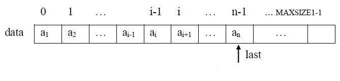
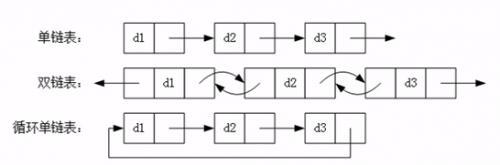
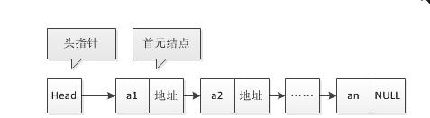

# 线性表

## 概念

$$(a_0, a_1, ..., a_{i-1}, a_i, a_{i+1}, ..., a_{n-1})$$

1. 元素之间存在顺序关系, $a_{i-1}$先于$a_i$, $a_i$先于$a_{i+1}$, 称$a_{i-1}$为$a_i$前驱, $a_{i+1}$为$a_i$后继, 第一个元素只有后继,
最后一个元素只有前驱, 其余元素都有唯一的前驱和后继;

2. 线性表的元素个数$n$为线性表的长度, 当$n=0$时称为空表;

3. $a_0$为首节点, $a_{n-1}$为尾结点;

4. 在非空线性表中, 每个元素都有唯一的位置;

## 线性表顺序表示

### 时间复杂度分析

| 方法            | 时间复杂度                            |
## e| --------------- | ----------------------------------- |
| 遍历            | $O(n)$                              |
| 查找值为value元素| $O(n)$                              |
| 求前驱后继       | $O(1)$                              |
| 插入运算         | $O(n)$                              |
| 删除运算         | $O(n)$                              |
| 逆置运算         | $O(n)$                              |
| 扩充运算         | $O(n)$                              |
| 合并运算         | $O(n+m)$                            |

| 时间           | 任务                                |
## e| -------------- | ----------------------------------- |
| 2020年3月~6月  | 找暑期实习/上届春招（补招）         |
| 2020年6月~8月  | 秋招提前批（神仙打架）              |
| 2020年9月~11月 | 秋招正式批（神仙继续打架+菜鸡互啄） |

### 顺序表特点

1) 需要预分配存储空间, 难以恰当预留空间, 分配大了造成浪费, 分配小了造成溢出;
2) 逻辑顺序与物理顺序一致, 可按元素序号直接存取元素, 插入删除操作效率低;
3) 改变顺序表大小, 需要重新创建新的顺序表, 耗费空间资源;
4) 顺序表适合静态, 经常用于定位访问的线性表;

## 线性表链式表示

### 基本概念

**头指针:** 链表中第一个结点的地址(指针);
**首元结点:** 链表中第一个元素所在结点;
**头结点:** 链表中第一个结点前加入的新结点, 不存储元素, 为了运算方便;

## 双链表

## 循环链表